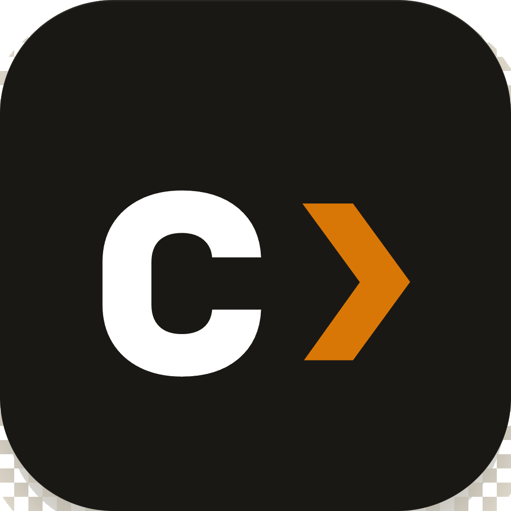

#  Claudin


**One coding agent CLI. Any LLM.**

Claudin brings a terminal-first agentic workflow — bash, file tools, grep, glob, agents, MCP, slash commands, streaming — to any model provider. Switch between OpenAI, Gemini, DeepSeek, Ollama, Mistral, GitHub Copilot, Bedrock, Vertex, and 200+ OpenAI-compatible endpoints without changing your workflow.

> Independent project. Not affiliated with, endorsed by, or sponsored by Anthropic.

---


---

## Install

Requires Node.js 20+.

```bash
npm install -g @claudiolabs/claudin@latest
```

Works on **Linux**, **macOS**, and **Windows**.

---

## Quick Start

```bash
claudin
```

On first run, Claudin opens the `/provider` wizard automatically. Pick a preset, enter your credentials, and start coding — no config files required.

```
/provider          # add, edit, or switch provider profiles
/provider doctor   # health check: reachability, auth, model availability
```

---

## Supported Providers

| Provider | Preset | Auth |
|---|---|---|
| Anthropic | `anthropic` | API key or OAuth |
| OpenAI | `openai` | API key |
| DeepSeek | `deepseek` | API key |
| Gemini | `gemini` | API key |
| Mistral | `mistral` | API key |
| GitHub Copilot | `github-copilot` | GitHub OAuth |
| Codex (ChatGPT) | `codex` | ChatGPT OAuth |
| Ollama | `ollama` | None — local, free |
| AWS Bedrock | `bedrock` | AWS credential chain |
| Google Vertex | `vertex` | Application Default Credentials |
| Azure Foundry | `foundry` | `DefaultAzureCredential` |
| OpenRouter | `openrouter` | API key |
| Groq | `groq` | API key |
| LM Studio | `lmstudio` | None — local |
| Any OpenAI-compatible | `custom` | Base URL + optional key |

---

## Local Model (Ollama, No Key)

```bash
ollama pull qwen2.5-coder:7b
ollama launch claudin --model qwen2.5-coder:7b
```

---

## License

See [LICENSE](LICENSE).
